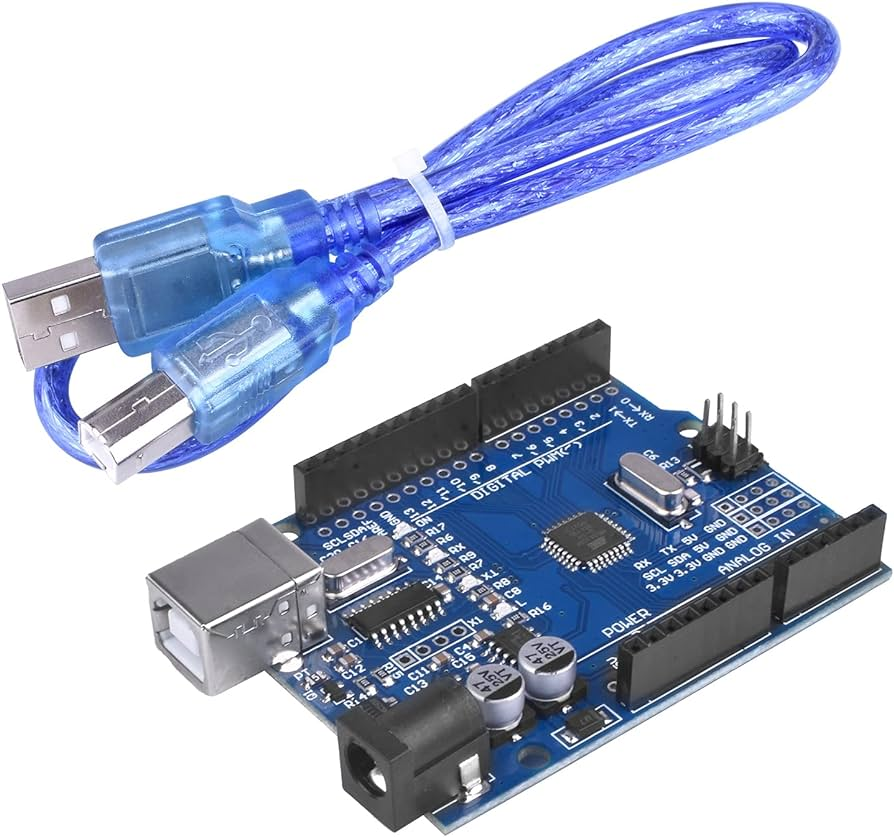
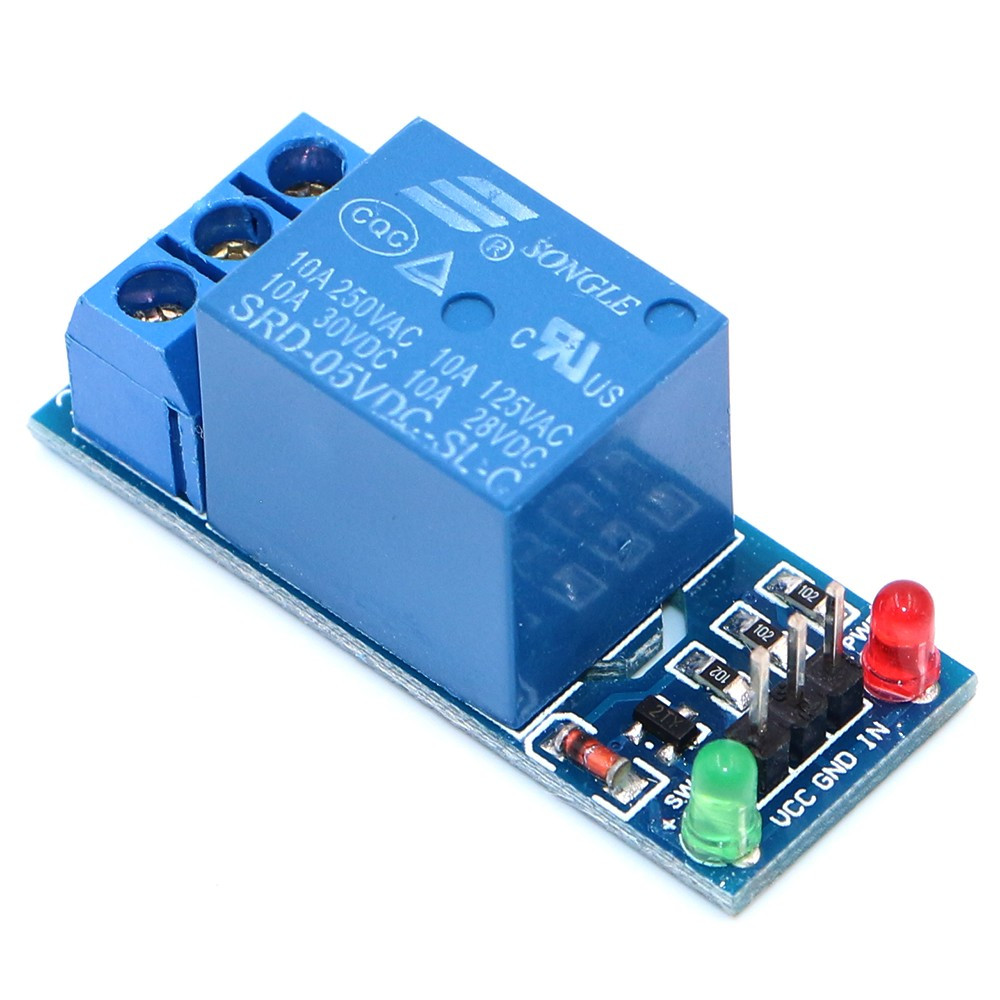
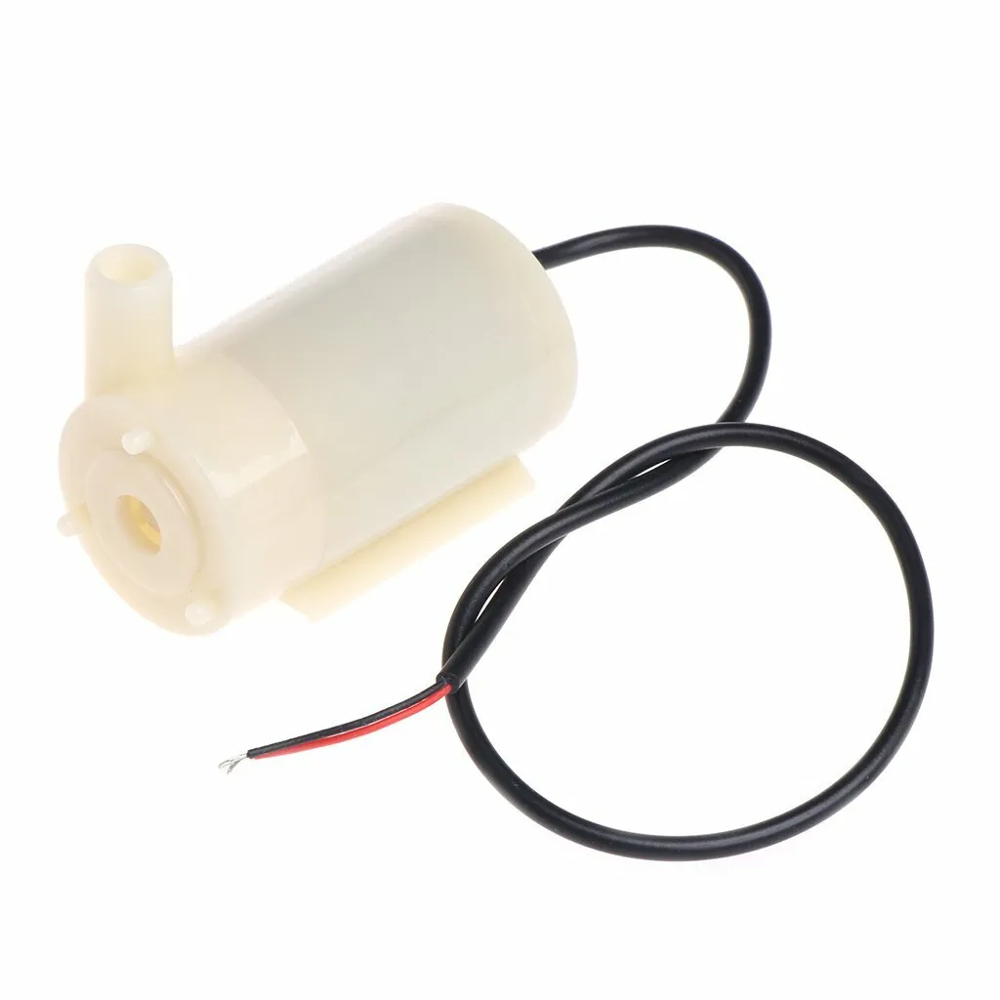
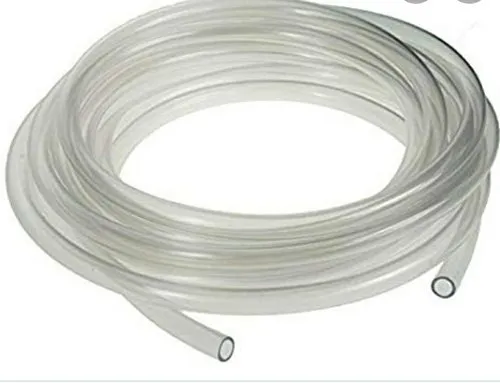
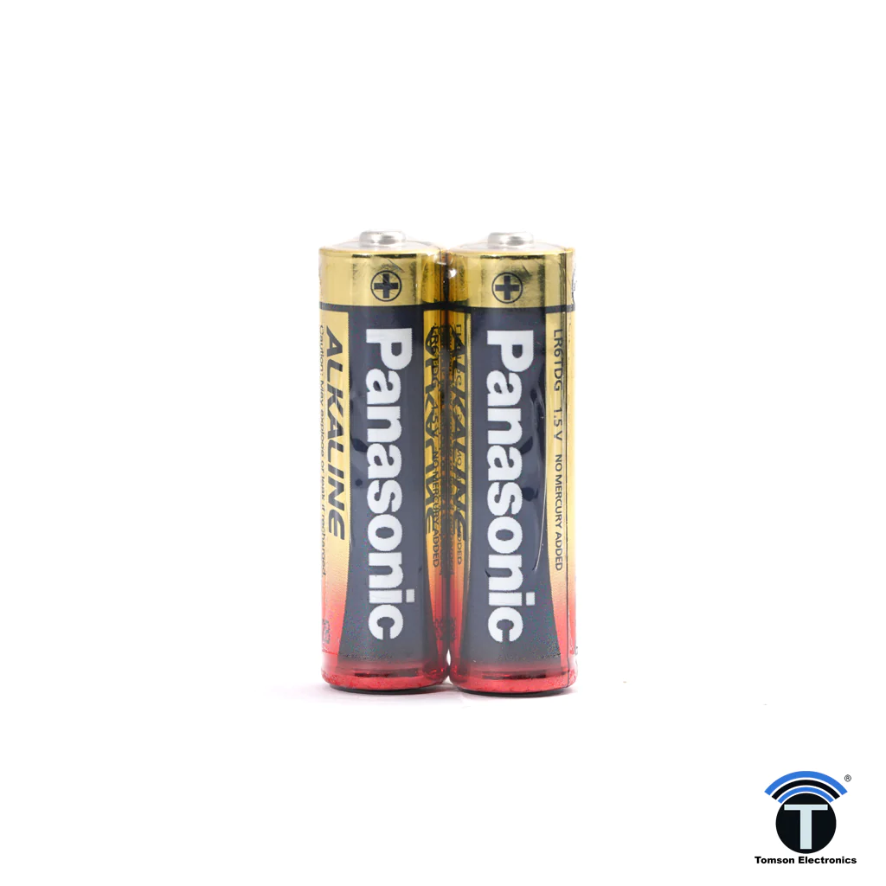
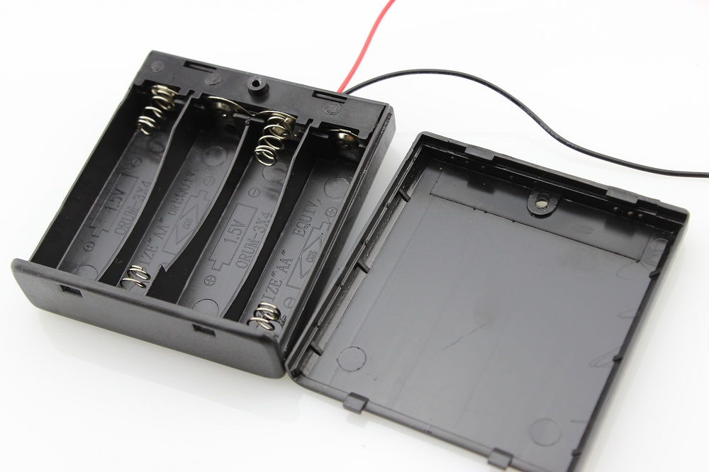

# Smart Garden

this project is created by student of **NIE BA+2 Generetion 2**, major **EN-IT**.

This project is create for research popose use for wattering in garden or farm by automatic or manually via mobile phone (android only).

## Pre-requirement

| No | Name                                   | Quantity |
|:--:|:-------------------------------------- |:--------:|
| 1  | Computer installed Arduino IDE         | x1       |
| 2  | Basic of programming language (c, c++) | Basic    |
| 3  | Arduino UNO R3 MEGA328 + USB Cable     | x1       |
| 4  | HC-05 Wireless Serial 6pins            | x1       |
| 5  | Soil Miosture Meter Detection          | x1       |
| 6  | 5V Relay Module Blue Board             | x1       |
| 7  | Water Pump Mini 3-6V                   | x1       |
| 8  | Water Pipe                             | 1meter   |
| 9  | Battery AA 1.5V                        | x4       |
| 10 | Batter Hoilder AA x4                   | 1x       |

## Images

1. Arduino UNO R3 MEGA328 + USB Cable

2. HC-05 Wireless Serial 6pins

3. Soil Miosture Meter Detection

4. 5V Relay Module Blue Board

5. Water Pump Mini 3-6V

6. Water Pipe

7. Battery AA 1.5V

8. Batter Hoilder AA x4
