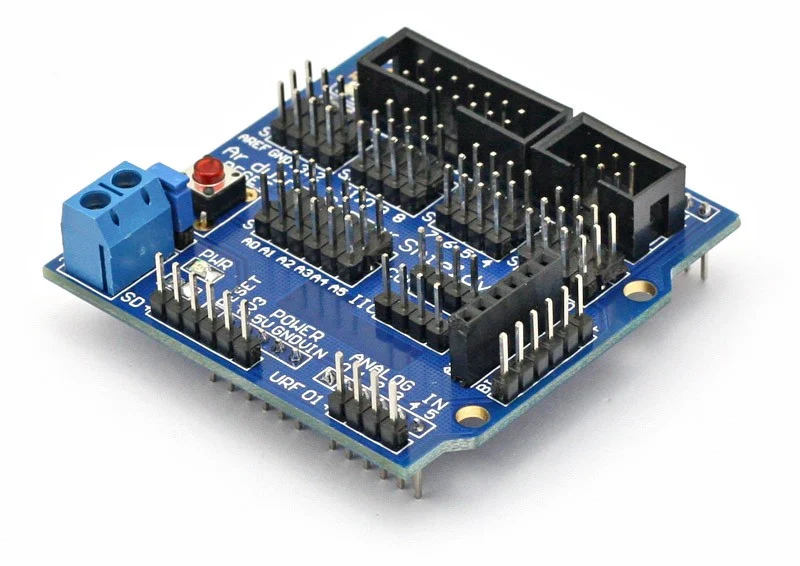

# Smart Garden

this project is created by student of **NIE BA+2 Generetion 2**, major **EN-IT**.

This project is create for research popose use for wattering in garden or farm by automatic or manually via mobile phone (android only).

## Pre-requirement

| Name                                   | Quantity |
|:-------------------------------------- |:--------:|
| Computer installed Arduino IDE         | x1       |
| Basic of programming language (c, c++) | Basic    |
| Arduino UNO R3 MEGA328 + USB Cable     | x1       |
| Sensor Shield UNO IO Expansion         | x1       |
| HC-05 Wireless Serial 6pins            | x1       |
| Soil Miosture Meter Detection          | x1       |
| 5V Relay Module Blue Board             | x1       |
| Water Pump Mini 3-6V                   | x1       |
| Water Pipe                             | 1meter   |
| Battery AA 1.5V                        | x4       |
| Batter Hoilder AA x4                   | 1x       |

## Images

- Arduino UNO R3 MEGA328 + USB Cable

- Sensor Shield UNO IO Expansion

- HC-05 Wireless Serial 6pins

- Soil Miosture Meter Detection

- 5V Relay Module Blue Board

- Water Pump Mini 3-6V

- Water Pipe

- Battery AA 1.5V

- Batter Hoilder AA x4

